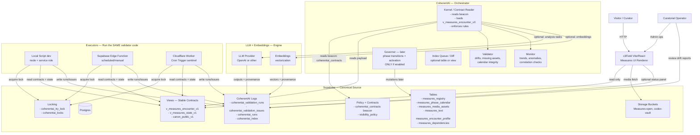

# c3 Field — Full System Flow

```mermaid
flowchart TB

  %% -------------------------
  %% USERS + SITE
  %% -------------------------
  U[Visitor / Curator] -->|HTTP| SITE[c3Field Vite/React\nMeasures UI Renderer]
  ADMIN[Curatorial Operator] -->|Admin ops| SITE

  %% -------------------------
  %% SUPABASE CORE (CANON)
  %% -------------------------
  subgraph SB[Supabase — Canonical Source]
    ST[Storage Buckets\nMeasures-open, codex-vault]
    DB[(Postgres)]
    V1[Views — Stable Contracts\n- v_measures_encounter_v1\n- v_measures_state_v1\n- canon_public_v1]
    REG[Tables\n- measures_registry\n- measures_phase_calendar\n- measures_media_assets\n- measures_text\n- measures_encounter_profile\n- measures_dependencies]
    POL[Policy + Contracts\n- coherentai_contracts beacon\n- visibility_policy]
    LOG[CoherentAI Logs\n- coherentai_validation_runs\n- coherentai_validation_issues\n- coherentai_runs\n- coherentai_index]
    LOCK[Locking\n- coherentai_try_lock\n- coherentai_locks]
  end

  SITE -->|read only| V1
  SITE -->|media fetch| ST

  %% -------------------------
  %% COHERENTAI ORCHESTRATOR
  %% -------------------------
  subgraph CAI[CoherentAI — Orchestrator]
    CORE[Kernel / Contract Reader\n- reads beacon\n- loads v_measures_encounter_vX\n- enforces rules]
    VALID[Validator\ndrifts, missing assets,\ncalendar integrity]
    MON[Monitor\ntrends, anomalies,\ncorrelation checks]
    GOV[Governor — later\nphase transitions + activation\nONLY if enabled]
    QUEUE[Index Queue / Diff\noptional table or view]
  end

  %% -------------------------
  %% LLM ENGINE (PLUGGABLE)
  %% -------------------------
  subgraph LLM[LLM + Embeddings — Engine]
    MODEL[LLM Provider\nOpenAI or other]
    EMB[Embeddings\nvectorization]
  end

  %% -------------------------
  %% EXECUTORS (REDUNDANCY)
  %% -------------------------
  subgraph EX[Executors — Run the SAME validator code]
    LOCAL[Local Script dev\nnode + service role]
    EDGE[Supabase Edge Function\nscheduled/manual]
    CF[Cloudflare Worker\nCron Trigger sentinel]
  end

  %% -------------------------
  %% DATA FLOWS
  %% -------------------------
  LOCAL -->|acquire lock| LOCK
  EDGE -->|acquire lock| LOCK
  CF -->|acquire lock| LOCK

  LOCAL -->|read contracts + state| V1
  EDGE -->|read contracts + state| V1
  CF -->|read contracts + state| V1

  LOCAL -->|write runs/issues| LOG
  EDGE -->|write runs/issues| LOG
  CF -->|write runs/issues| LOG

  CORE -->|reads beacon: coherentai_contracts| POL
  CORE -->|reads payload| V1
  CORE --> VALID
  CORE --> MON
  GOV -->|mutations later| REG

  %% -------------------------
  %% LLM INTEGRATION
  %% -------------------------
  CORE -->|optional: analysis tasks| MODEL
  CORE -->|optional: embeddings| EMB
  MODEL -->|outputs + provenance| LOG
  EMB -->|vectors + provenance| LOG

  %% -------------------------
  %% OBSERVABILITY / HUMAN FEEDBACK
  %% -------------------------
  ADMIN -->|review drift reports| LOG
  SITE -->|optional status panel| LOG
```
